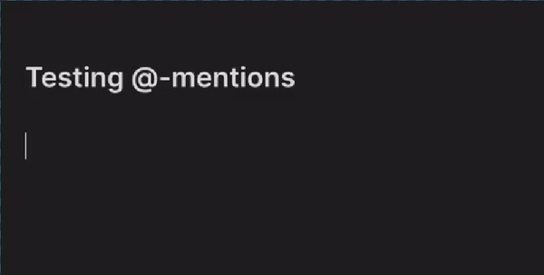
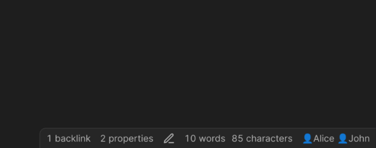

# People mentions plugin for Obsidian

This is a quick personal plugin to give me a list of people to @-mention.

I bind the `Mention person` command to Alt+2, which is very close to Shift+2, aka the `@` symbol. This way it's almost like @-ing someone to get the popup list. 

I have a People folder with a note for each person I reference, and the plugin automatically populates the suggestion modal with every note in that folder.

The popup is ordered by how many notes link to that person descending.

In the gif above you can see a 👤 symbol in the note link. That's just the way I name my people notes. You could use a `@`, or no prefix at all, up to you. 
However I love the 👤, which I think makes them look really nice in a note:

It also works fine in the filenames of notes in your file browser.

Then in the status bar of your note you'll see all the people you mentioned:

## Installation

You will need to install this plugin with BRAT, as it's not in the community plugin store.

1. Install BRAT from the Community Plugins store ([direct link](https://obsidian.md/plugins?id=obsidian42-brat)).

2. Go into the settings for BRAT and choose **Add Beta plugin**.

3. Paste in `https://github.com/alangrainger/obsidian-mentions` and click **Add Plugin**.

4. Go back to the Plugins settings page, and enable the **Lazy Plugin Loader** plugin:
