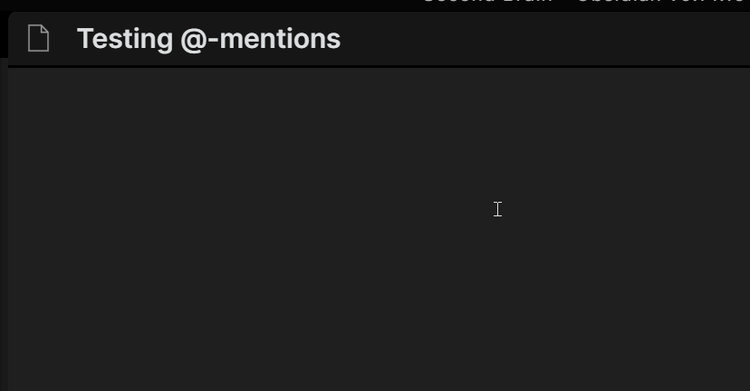

# People mentions plugin for Obsidian

This is a quick personal plugin to give me a list of people to @-mention.

I bind the `Mention person` command to Alt+2, which is very close to Shift+2, aka the `@` symbol. This way it's almost like @-ing someone to get the popup list. 

I have a People folder with a note for each person I reference. 

In the gif above you can see an '@' prefix for each person, but that's outdated. I now use the 👤 character, which makes them look really nice in a note:

